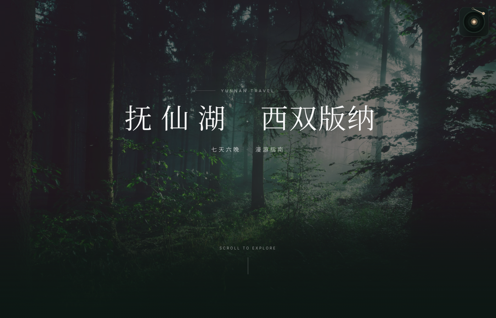
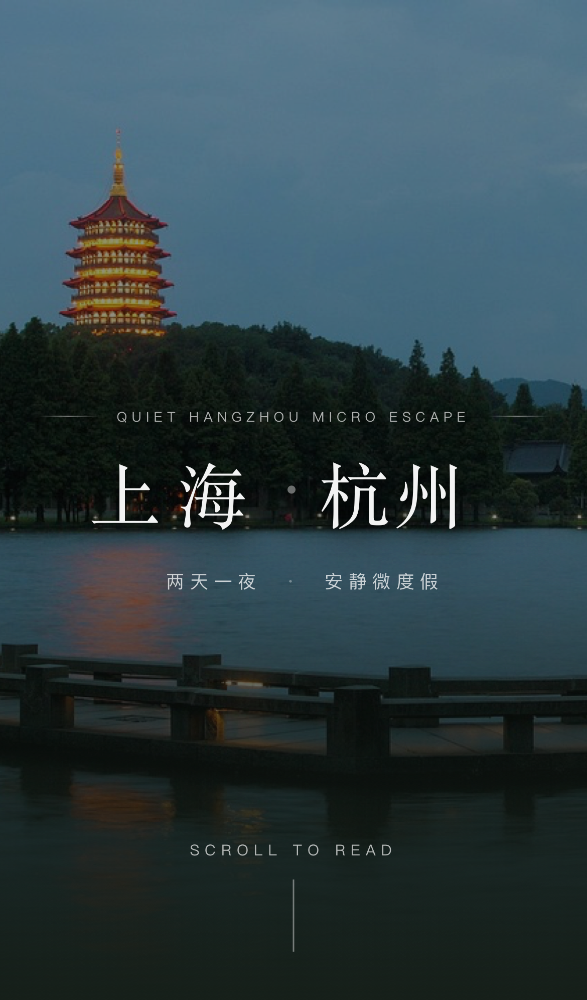

[简体中文](./README.md)



# Dark Luxury Itinerary Skill

Have you ever had one of those moments?

You already did the hard part. The route is planned, the restaurants are picked, the hotel is decided, the notes are written. But the final thing you send out still feels like a rushed document dump. The information is there, but the feeling is gone.

Or maybe you only have the outline in your head: from where to where, how many days, what mood you want, roughly what budget you can accept. And the moment you realize you still need to build the route guide, source images, shape the page, and make it all look good, the energy drops immediately.

If that sounds familiar, this skill is for you.

It turns trip requirements, existing itineraries, and first-person travel memoirs into a travel page that actually feels worth sharing.

In one sentence: you tell it where the trip is going, and it turns that trip into a polished, editorial-style microsite.

What makes it easy to love is pretty simple:

- Foolproof: give it a travel brief, and it can generate both the route guide and the page
- Beautiful: editorial magazine aesthetics, almost zero AI-UI feel, and optional ambient background music

Here is what it looks like in the wild.

## Real Outputs

These are real project outputs from the benchmark family and cold-start validation flow.

<table>
  <tr>
    <td align="center">
      <a href="https://dark-luxury-travel-itinerary.vercel.app">
        
      </a>
      <br />
      <strong>Xishuangbanna Route Guide</strong>
      <br />
      Fuxian Lake · Xishuangbanna itinerary
    </td>
    <td align="center">
      <a href="https://wuhan-jingshan-travel-guide.vercel.app">
        
      </a>
      <br />
      <strong>Jingshan Route Guide</strong>
      <br />
      Wuhan · Jingshan itinerary
    </td>
  </tr>
  <tr>
    <td align="center">
      <a href="https://youji.travel-itinerary-jingshan.online">
        
      </a>
      <br />
      <strong>Jingshan Memoir</strong>
      <br />
      Four-day memoir site
    </td>
    <td align="center">
      <a href="https://skill-solid-coldstart-routeguide-ag.vercel.app">
        
      </a>
      <br />
      <strong>Cold-start Validation</strong>
      <br />
      Hangzhou two-day route-guide test
    </td>
  </tr>
</table>

If you have ever built travel materials for yourself, your family, or a client, you probably know these small frustrations:

- the itinerary is finished, but what you share still looks like a long document
- you want it to feel premium, but all your time disappears into image hunting, layout tweaking, and mobile fixes
- you only wanted a route page people could actually read and forward, but it slowly turned into a template-looking site
- every new destination means rebuilding the same structure, prompts, and visual logic all over again

This skill exists to absorb that repeated work.

It helps align route structure, visual pacing, imagery, tag semantics, and music interaction first, then turns them into a travel site that is actually usable.

It is especially helpful for:

- family trip planning that should feel polished without becoming a design project
- independent travel agencies or small studios presenting curated routes
- memoir, diary, and guide writers who want their content to feel shareable instead of merely readable

## How To Start

The good news: in most setups, you do not need to start with the `.skill` package at all.

If you just want the fastest path, wire these instructions into the agent you already use, then prompt it with something like:

> Build a two-day travel route-guide site from Wuhan to Xiangyang, mobile-first, with an editorial look, locally sourced images, and a gentle ambient BGM.

Here are the most practical ways to use it.

### Cursor

If you use Cursor, the easiest path is usually not package installation. It is project-level rules.

- Simple path: put the condensed instructions in `AGENTS.md` at the project root
- Rules path: place them in `.cursor/rules/` as a reusable `.mdc` rule
- CLI path: `cursor-agent` reads the same `.cursor/rules`, and also understands root-level `AGENTS.md` and `CLAUDE.md`

So the same guidance can usually work in both Cursor IDE and Cursor CLI.

### Claude Code

Claude Code does not need a native skill installer to make this useful.

- Simplest path: put the core instructions in your project `CLAUDE.md`
- Better for repetition: create `.claude/commands/travel-web.md`, then call it with `/travel-web`
- Better for teams: commit `CLAUDE.md` and `.claude/commands/` into the repo

That way, you do not have to retype the whole prompt every time.

### OpenCode

OpenCode works especially well when this is turned into a dedicated agent.

- create `.opencode/agents/travel-web.md`
- place the core travel-web instructions there
- call it in chat with `@travel-web`

If you want the behavior to stay with the project, this is a very light setup.

### OpenClaw

OpenClaw is the closest to a native skill workflow.

- copy `dark-luxury-editorial-web-skill/` into `<workspace>/skills/`
- or place it in `~/.openclaw/skills/` for system-wide reuse
- use `dist/dark-luxury-editorial-web-skill.skill` when you want a packaged artifact for sharing or backup

For OpenClaw, the real source of truth is the skill folder itself. The `.skill` file is the packaged form.

### If You Just Want To Copy Something And Go

Start here:

- `dark-luxury-editorial-web-skill/SKILL.md`

You can treat it as the master prompt and adapt it into `AGENTS.md`, `CLAUDE.md`, `.cursor/rules/`, `.opencode/agents/`, or an OpenClaw `skills/` directory, depending on the app you use.

## What’s In This Repository?

- `dark-luxury-editorial-web-skill/`
  Full skill source

- `dark-luxury-editorial-web-skill/SKILL.md`
  Core workflow, guardrails, visual system, and QA rules

- `dark-luxury-editorial-web-skill/references/`
  Benchmarking, itinerary planning, writing guidance, implementation recipes, and media workflow references

- `dist/dark-luxury-editorial-web-skill.skill`
  Packaged installable artifact

## Common Ways To Use It

1. Install the `.skill` artifact and use it directly for new travel-web projects
2. Use `SKILL.md + references/` as your editable SOP baseline
3. Use it to calibrate your own travel-web agent so it stops producing template-looking pages

## Install Artifact

- `dist/dark-luxury-editorial-web-skill.skill`

## Repository Structure

```text
.
├── assets/
│   └── screenshots/
├── dark-luxury-editorial-web-skill/
│   ├── SKILL.md
│   ├── agents/
│   └── references/
└── dist/
    └── dark-luxury-editorial-web-skill.skill
```

## Current Version

- `v1.0.0`
